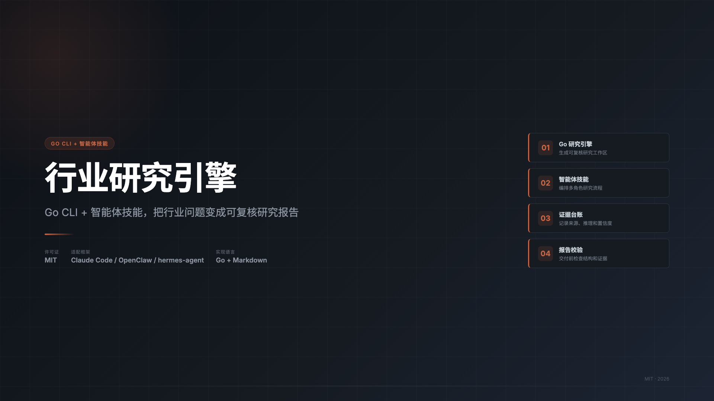
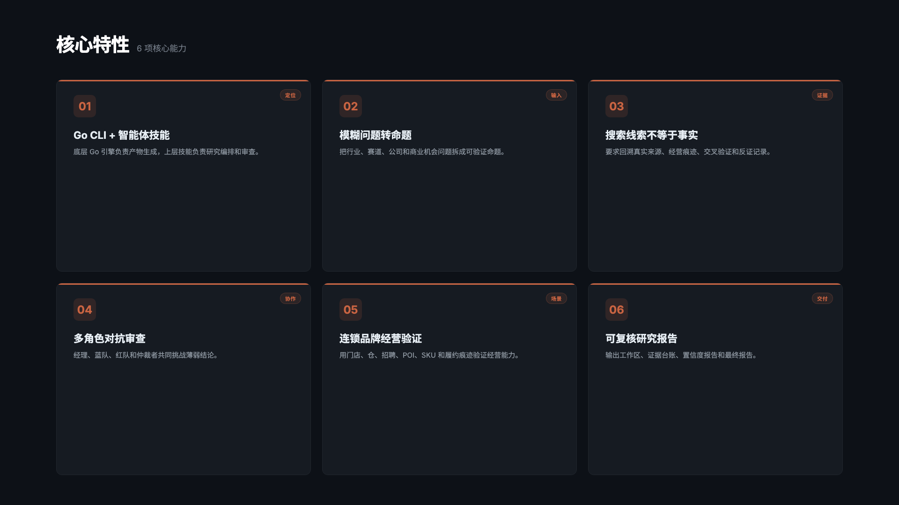
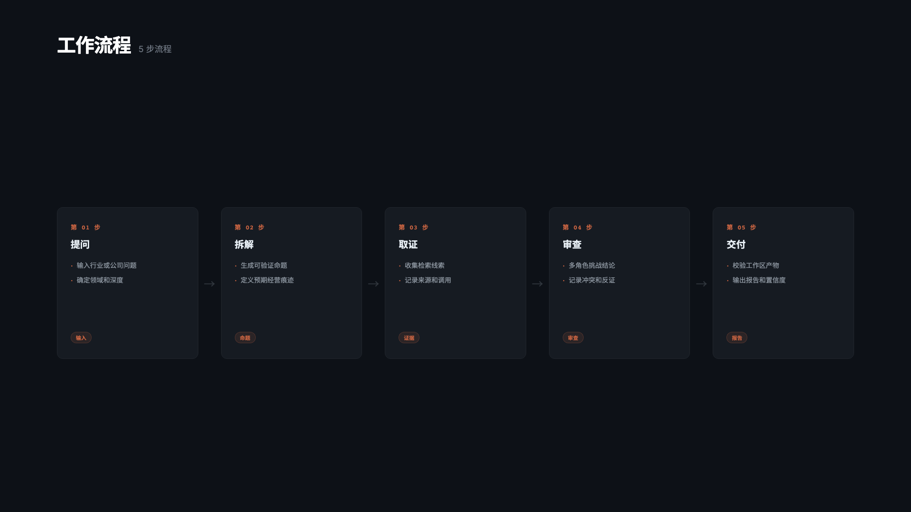

<div align="center">

# 行业研究引擎：Go CLI + 智能体技能

**把行业、赛道和公司问题变成可复核研究报告**



[](./LICENSE)
[](./researcher/go.mod)
[](./SKILL.md)
[](./references/evidence-ledger-schema.md)

</div>

---

## 这是什么

行业研究引擎是一套 **Go CLI + 智能体技能**。它把模糊的行业研究、赛道分析、公司研究和商业机会判断，转成可复核的研究工作区和结构化报告。

底层 `researcher` 是 Go 写的研究引擎，负责生成命题图、痕迹计划、证据台账、反证记录、置信度报告和最终报告。上层 `SKILL.md` 是智能体技能，负责把研究流程编排给 Claude Code、OpenClaw、hermes-agent 等支持技能式工作流的 Agent 框架。

它的核心原则很简单：搜索结果只是线索，不是证据。高置信度结论必须经过来源核验、经营痕迹验证、交叉比对和反证尝试。

## 项目摘要

| 问题 | 回答 |
|:---|:---|
| 这是什么 | 面向 Agent 的行业研究技能和 Go 研究引擎 |
| 解决什么问题 | 避免行业研究只复述搜索结果，生成可复核、有证据边界的研究报告 |
| 适合谁 | 使用智能体做行业研究、投资研究、赛道分析、连锁品牌和供应链研究的人 |
| 产出什么 | 研究工作区、命题图、证据台账、反证记录、置信度报告和最终报告 |
| 为什么可信 | 每个关键结论都要求来源、经营痕迹、交叉验证和反证尝试 |

```text
输入：瑞幸咖啡 2026 年门店数目标是否可信？
输出：可复核工作区、证据台账、反证记录、置信度报告和最终调研报告
```

---

## 核心特性



| 能力 | 说明 |
|:---|:---|
| Go 研究引擎 | 用 `researcher` 生成可复核工作区，而不是只产出一段不可追溯的文本 |
| 智能体技能 | 用 `SKILL.md` 编排行业研究流程，可迁移到 Claude Code、OpenClaw、hermes-agent 等框架 |
| 证据台账 | 把搜索线索、来源材料、推理结果和最终结论分层记录 |
| 对抗式审查 | 通过经理、蓝队、红队和仲裁者角色挑战薄弱结论 |
| 经营痕迹验证 | 对连锁品牌、餐饮、零售、供应链问题优先查门店、仓、招聘、POI、SKU 和履约痕迹 |
| 报告校验 | 检查章节、引用、置信度、工作区产物和证据边界 |

---

## 工作流程



1. 输入行业、赛道、公司或商业机会问题。
2. 把问题拆成可验证命题，并规划现实世界应留下的痕迹。
3. 收集网页、公告、招聘、地图、经营系统和模型联网回答等线索。
4. 用证据台账、反证记录和多角色审查降低误判。
5. 输出带置信度边界的研究报告。

---

## 适合场景

| 场景 | 示例 |
|:---|:---|
| 行业研究 | 某赛道是否值得进入，市场增长是否真实 |
| 投资研究 | 某公司增长目标是否可信，估值假设是否站得住 |
| 连锁品牌研究 | 门店扩张、加盟质量、区域履约和供应链能力是否真实 |
| 餐饮零售供应链 | 单店模型、履约成本、SKU 动销、仓配能力和产能利用率 |
| Agent 工作流 | 给智能体提供可复用的研究步骤、证据规则和交付标准 |

---

## 安装

克隆仓库并构建研究引擎：

```bash
git clone git@github.com:geekjourneyx/industry-research.git
cd industry-research/researcher
make build
```

检查可执行文件：

```bash
./researcher version
./researcher capabilities --json
```

更多命令、配置和检索服务说明见 [researcher 使用说明](./researcher/README.md)。

可选的检索服务密钥：

```bash
export BOCHA_API_KEY="..."
export ARK_API_KEY="..."
```

配置读取顺序如下：

```text
--config <path>
RESEARCHER_CONFIG
$XDG_CONFIG_HOME/researcher/config.yaml
~/.config/researcher/config.yaml
```

---

## 快速上手

如果只想使用底层研究引擎，可以直接阅读 [researcher 使用说明](./researcher/README.md)。

生成一份连锁品牌研究工作区：

```bash
cd researcher

./researcher run "瑞幸咖啡 2026 年门店数目标是否可信？" \
  --domain chain-brand \
  --depth standard \
  --workspace-root ../industry-research-workspace \
  --json
```

校验生成的工作区：

```bash
./researcher validate ../industry-research-workspace/<workspace>

python3 ../scripts/validate_report.py \
  --researcher-workspace ../industry-research-workspace/<workspace>
```

运行本地检查：

```bash
make fmt
make vet
make test
make build
```

---

## 产物结构

每次执行 `researcher run` 都会生成以下工作区文件：

| 文件 | 作用 |
|:---|:---|
| `question.json` | 原始问题、研究领域、报告深度和创建时间 |
| `research_plan.json` | 研究计划和执行范围 |
| `claim_graph.json` | 需要验证或反证的核心命题 |
| `trace_plan.json` | 每个命题应当留下的现实世界痕迹 |
| `retrieval_log.json` | 检索调用、参数、重试和来源使用情况 |
| `evidence_ledger.json` | 证据记录和支撑状态 |
| `disconfirmation_log.json` | 反证尝试和削弱结论的记录 |
| `confidence_report.json` | 置信度评级和理由 |
| `final_report.md` | 面向用户的最终研究报告 |
| `report_metadata.json` | 执行模式、降级标签和报告元数据 |

餐饮、零售、供应链和连锁品牌研究中，最关键的质量文件是 `trace_plan.json`、`evidence_ledger.json`、`disconfirmation_log.json` 和 `confidence_report.json`。

---

## 证据原则

系统会把弱研究报告里经常混在一起的四层内容拆开：

| 层级 | 使用方式 |
|:---|:---|
| 搜索结果 | 只能作为后续核验线索，不能直接当成证据 |
| 来源材料 | 可访问的文件、网页、公告、帖子或经营痕迹 |
| 推理结果 | 基于事实和约束得出的估算，必须明确标注 |
| 最终结论 | 结论置信度必须和证据质量匹配 |

对于毛利、单店模型、产能利用率、SKU 动销、履约成本、留存率等隐藏经营变量，报告必须区分公开披露事实和推理区间，并写明还缺哪些一手数据。

---

## 项目地图

| 路径 | 作用 |
|:---|:---|
| `SKILL.md` | 智能体技能编排契约 |
| [`researcher/`](./researcher/README.md) | 用于生成工作区、检索、规划和校验的研究引擎 |
| `agents/` | 经理、蓝队、红队和仲裁者等评审角色 |
| `references/` | 证据规则、报告模板、痕迹推理和分析框架 |
| `scripts/validate_report.py` | 报告和工作区校验脚本 |
| `evals/` | 评测问题和预期产物 |

---

## 搜索与引用信息

一句话描述：

```text
行业研究引擎是一个 Go CLI + 智能体技能，用于把行业、赛道和公司问题转成可复核的研究工作区、证据台账、置信度报告和最终研究报告。
```

GitHub Description 建议：

```text
Go CLI + Agent Skill for evidence-based industry research, evidence ledgers, confidence reports, and agent research workflows
```

Topics 建议：

```text
agent-skill  industry-research  market-research  go  cli
evidence-ledger  research-automation  competitive-intelligence
chain-brand  supply-chain
```

---

## 许可证

[MIT](./LICENSE) — 自由使用、修改、分发。

---

## 作者

| | |
|:---|:---|
| 个人主页 | [jieni.ai](https://jieni.ai) |
| GitHub | [geekjourneyx](https://github.com/geekjourneyx) |
| Twitter | [@seekjourney](https://x.com/seekjourney) |
| 公众号 | 微信搜「极客杰尼」 |
